# Docker and Kubernetes

> This is a tutorial course covering Docker and Kubernetes.

Tools used:

- JDK 11
- Maven
- JUnit 5, Mockito
- IntelliJ IDE
- WSL2
- Docker Engine

## Table of contents

1. [Introduction to Docker](https://github.com/backstreetbrogrammer/50_DockerAndKubernetes?tab=readme-ov-file#chapter-01-introduction-to-docker)
2. [Docker Installation](https://github.com/backstreetbrogrammer/50_DockerAndKubernetes?tab=readme-ov-file#chapter-02-docker-installation)
3. [Docker Deep Dive](https://github.com/backstreetbrogrammer/50_DockerAndKubernetes?tab=readme-ov-file#chapter-03-docker-deep-dive)
    - [Docker CLI](https://github.com/backstreetbrogrammer/50_DockerAndKubernetes?tab=readme-ov-file#docker-cli)
    - [Building custom images](https://github.com/backstreetbrogrammer/50_DockerAndKubernetes?tab=readme-ov-file#building-custom-images)
    - [Build a maven-based Java project in Docker](https://github.com/backstreetbrogrammer/50_DockerAndKubernetes?tab=readme-ov-file#build-a-maven-based-java-project-in-docker)
    - [Docker RUN vs CMD vs ENTRYPOINT](https://github.com/backstreetbrogrammer/50_DockerAndKubernetes?tab=readme-ov-file#docker-run-vs-cmd-vs-entrypoint)
4. [Docker Compose](https://github.com/backstreetbrogrammer/50_DockerAndKubernetes?tab=readme-ov-file#chapter-04-docker-compose)
5. Introduction to Kubernetes

---

## Chapter 01. Introduction to Docker

**_Why use Docker?_**

When we install **software** on our machine, we typically go through the following procedure and **may** get errors:

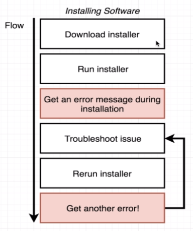

In the real world, it happens a lot that software works on one computer, but it does not work on others due to different
environments.

We can extend this concept to our production **applications**.

Our application can contain a lot of **dependencies** which may be not available or installed on the production server.

Also, it may be incompatible with the **versions** required for the application versus what version is installed on the
server.

Docker tries to fix it by using **containers** which contain all the dependencies with correct versions needed for the
software or application to run.

It runs as a **sandbox** without any dependencies needed from the underlying server.

Every developer on a team will have the exact same development instance.

Each testing instance is exactly the same as the development instance.

Our production instance is exactly the same as the testing instance.

Also, developers around the world can share their **Docker images** on a platform called
[docker hub](https://hub.docker.com/).

**_What is Docker?_**

> Docker is a set of platform as a service (PaaS) products that use OS-level virtualization to deliver software in
> packages called containers.

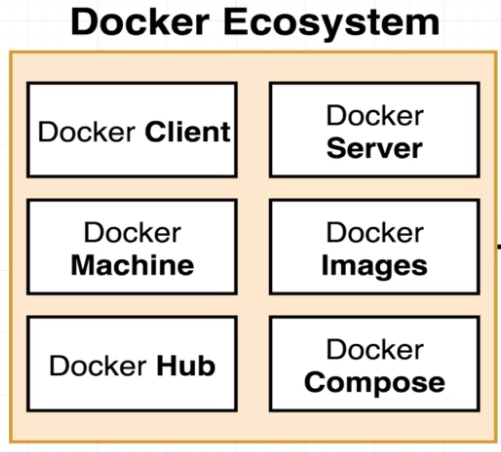

Docker is a platform or ecosystem around creating and running **containers**.

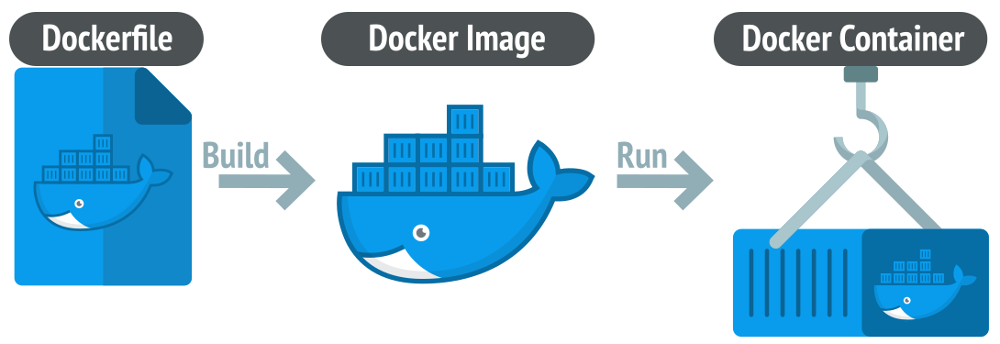

Docker builds **images** and runs **containers** by using the **docker engine** on the **host machine**.

Docker **containers** consist of all the dependencies and software needed to run an application in different
environments.

---

## Chapter 02. Docker Installation

**Install Docker:**

- [Installing Docker on Windows](https://docs.docker.com/desktop/install/windows-install/)
- [Installing Docker on MacOS](https://docs.docker.com/desktop/install/mac-install/)
- [Installing Docker on Linux](https://docs.docker.com/desktop/install/linux-install/)

**Install WSL2 on Windows:**

- Open Powershell in administrative mode
- Type this command: `wsl --install`
- Restart the system
- After restart, `Ubuntu` app will be installed
- Set up Linux username and password
- Disable IPv6 on WSL2

```
sudo sysctl -w net.ipv6.conf.all.disable_ipv6=1
sudo sysctl -w net.ipv6.conf.default.disable_ipv6=1
```

**Install Java JDK version 11 in WSL2**

- Run these three commands one by one:

```
wget -O- https://apt.corretto.aws/corretto.key | sudo apt-key add - 
sudo add-apt-repository 'deb https://apt.corretto.aws stable main'
sudo apt-get update; sudo apt-get install -y java-11-amazon-corretto-jdk
```

- Verify by running command: `java -version`

**_Install Docker in Ubuntu on WSL2_**

- Set up Docker's apt repository

```
# Add Docker's official GPG key:
sudo apt-get update
sudo apt-get install ca-certificates curl
sudo install -m 0755 -d /etc/apt/keyrings
sudo curl -fsSL https://download.docker.com/linux/ubuntu/gpg -o /etc/apt/keyrings/docker.asc
sudo chmod a+r /etc/apt/keyrings/docker.asc
```

```
# Add the repository to Apt sources:
echo \
"deb [arch=$(dpkg --print-architecture) signed-by=/etc/apt/keyrings/docker.asc] https://download.docker.com/linux/ubuntu \
$(. /etc/os-release && echo "$VERSION_CODENAME") stable" | \
sudo tee /etc/apt/sources.list.d/docker.list > /dev/null
sudo apt-get update
```

- Install the Docker packages

```
sudo apt-get install docker-ce docker-ce-cli containerd.io docker-buildx-plugin docker-compose-plugin
```

- Configuring Docker on WSL2

    - Using Docker Without Invoking Root

```
sudo groupadd docker
sudo usermod -aG docker $USER

# restart Ubunutu

# verify installation
docker run hello-world
```

- Starting the Docker Daemon

```
# add following in "~/.profile"

if [ -n "`service docker status | grep Stopped`" ]; then
    sudo /usr/sbin/service docker start
fi
```

- Fix asking root password at startup by running below commands:

```
# replace username with actual username of Ubuntu:

sudo visudo -f /etc/sudoers.d/passwordless_docker_start

username        ALL = (root) NOPASSWD: /usr/sbin/service docker start

# save and exit the file:
^S and then ^X
```

- Install **docker-compose**

```
sudo apt  install docker-compose
```

**_Verify installation_**

Launch Ubuntu app in WSL2 and lets run some docker CLI commands.

- Command: `docker version`

```
$ docker version
Client: Docker Engine - Community
 Version:           25.0.1
 API version:       1.44
 Go version:        go1.21.6
 Git commit:        29cf629
 Built:             Tue Jan 23 23:09:23 2024
 OS/Arch:           linux/amd64
 Context:           default

Server: Docker Engine - Community
 Engine:
  Version:          25.0.1
  API version:      1.44 (minimum version 1.24)
  Go version:       go1.21.6
  Git commit:       71fa3ab
  Built:            Tue Jan 23 23:09:23 2024
  OS/Arch:          linux/amd64
  Experimental:     false
 containerd:
  Version:          1.6.27
  GitCommit:        a1496014c916f9e62104b33d1bb5bd03b0858e59
 runc:
  Version:          1.1.11
  GitCommit:        v1.1.11-0-g4bccb38
 docker-init:
  Version:          0.19.0
  GitCommit:        de40ad0
```

The output shows details for both the Docker Client and Docker Server.

- Command: `docker run hello-world`

```
$ docker run hello-world

Hello from Docker!
This message shows that your installation appears to be working correctly.

To generate this message, Docker took the following steps:
 1. The Docker client contacted the Docker daemon.
 2. The Docker daemon pulled the "hello-world" image from the Docker Hub.
    (amd64)
 3. The Docker daemon created a new container from that image which runs the
    executable that produces the output you are currently reading.
 4. The Docker daemon streamed that output to the Docker client, which sent it
    to your terminal.

To try something more ambitious, you can run an Ubuntu container with:
 $ docker run -it ubuntu bash

Share images, automate workflows, and more with a free Docker ID:
 https://hub.docker.com/

For more examples and ideas, visit:
 https://docs.docker.com/get-started/
```

---

## Chapter 03. Docker Deep Dive

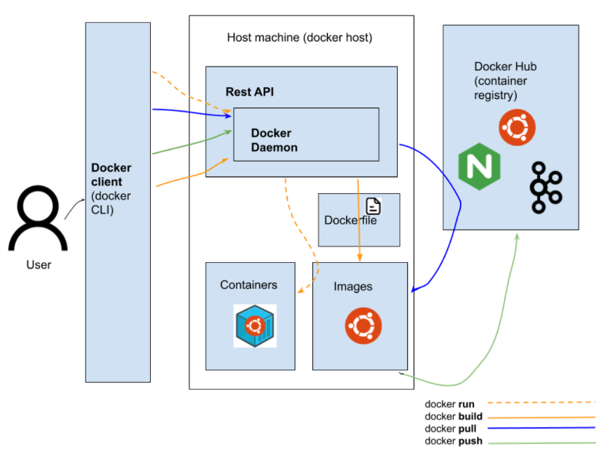

**_Linux Namespace_**

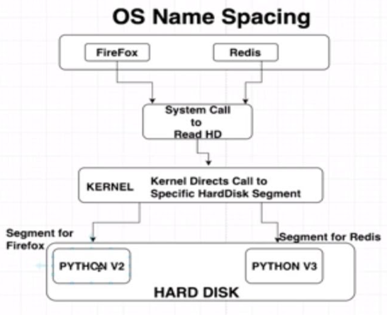

**Namespaces** are a feature of the Linux `kernel` that partition kernel resources such that one set of processes sees
one set of resources while another set of processes sees a different set of resources.

The feature works by having the same namespace for a set of resources and processes, but those namespaces refer to
distinct resources. Resources may exist in multiple spaces.

Examples of such resources are process IDs, host-names, user IDs, file names, some names associated with network access,
and Inter-process communication.

Namespaces are a fundamental aspect of **containers** in Linux.

**_Linux Control Groups_**

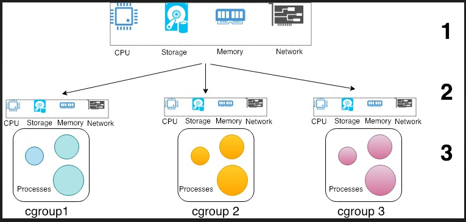

Linux Control Groups or `cgroups` is a Linux `kernel` feature that limits, accounts for, and isolates the resource
usage (CPU, memory, disk I/O, etc.) for a collection of processes.

**_Docker server_**

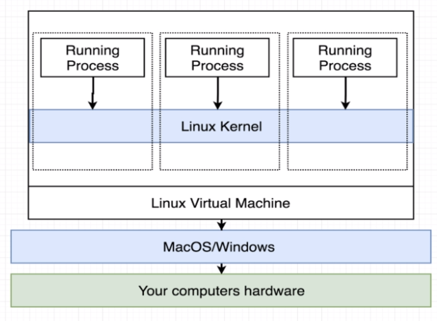

When Docker is installed, it creates a Linux virtual machine on top of our local machine OS.

This Linux Virtual Machine or Docker Host or Docker Server takes care of Docker containers run using **namespace** and
**cgroups**.

### Docker CLI

- Creating and running a container from an image:

```
$ docker run <image name>

docker = Reference the docker client
run = try to create and run a container
<image name> = name of image to use for this container 
```

For example, when we run the command: `docker run hello-world`, container is created and run:

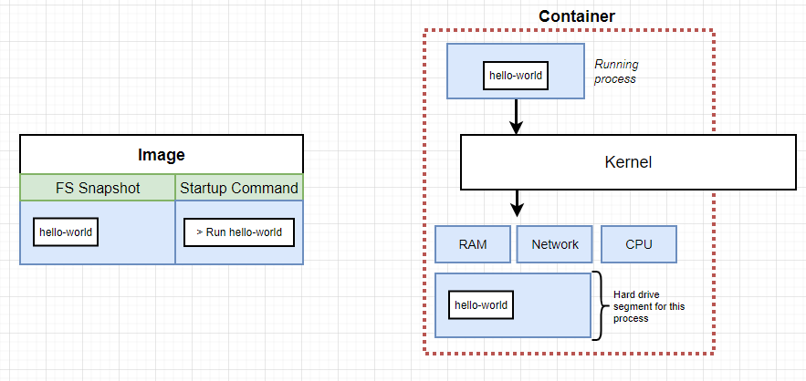

- Running a container with an overriding command

```
$ docker run <image name> <command>

<command> = default command override 
```

For example, we can run the following command:

```
$ docker run busybox echo hello Guidemy Students
Unable to find image 'busybox:latest' locally
latest: Pulling from library/busybox
9ad63333ebc9: Pull complete
Digest: sha256:6d9ac9237a84afe1516540f40a0fafdc86859b2141954b4d643af7066d598b74
Status: Downloaded newer image for busybox:latest
hello Guidemy Students
```

Here, we override the default command of the image `busybox` by another command to echo.

Similarly, we can use any other Linux command to override the default command.

```
$ docker run busybox ls
bin
dev
etc
home
lib
lib64
proc
root
sys
tmp
usr
var
```

- List all images:

`$ docker image ls`

- Delete a specific image:

`$ docker image rm [image name]`

- Delete all existing images:

`$ docker image rm $(docker images -a -q)`

- List all existing containers (running and not running):

`$ docker ps -a`

- List only the container ids (running and not running):

`$ docker ps -a -q`

- Stop a specific container:

`$ docker stop [container name]`

- Stop all running containers:

`$ docker stop $(docker ps -a -q)`

- Delete a specific container (only if stopped):

`$ docker rm [container name]`

- Delete all containers (only if stopped):

`$ docker rm $(docker ps -a -q)`

- Display logs of a container:

`$ docker logs [container name]`

**_Lifecycle of a container_**

Docker `run` command is actually a combination of `create` and `start` commands.

```
docker run = docker create + docker start
```

- **Create a container**

```
$ docker create <image name>

create = try to create a container
<image name> = name of image to use for this container
```

For example,

```
$ docker create hello-world
1eb2c149f968aed81c800854d811ef15003f84fedda588c50fc1d57e8a193b29
```

- **Start a container**

```
$ docker start <container id>

start = try to start a container
<container id> = id of the container to start
```

For example,

```
$ docker start -a 1eb2c149f968aed81c800854d811ef15003f84fedda588c50fc1d57e8a193b29
```

Option `-a` is given to show or attach the output to the console.

- **Restarting a stopped container**

We can get the container id of a stopped container (STATUS as **Exiting**) using `docker ps -a`.

Then, we can use the start command to run the container again.

For example,

```
$ docker ps -a
CONTAINER ID   IMAGE         COMMAND                  CREATED          STATUS                      PORTS     NAMES
1eb2c149f968   hello-world   "/hello"                 11 minutes ago   Exited (0) 10 minutes ago             funny_gates
...
...
c6d16c261df8   busybox       "echo hello Guidemy …"   38 minutes ago   Exited (0) 38 minutes ago             inspiring_poincare
```

```
$ docker start -a c6d16c261df8
hello Guidemy Students
```

One thing important to understand here is that both **images** and **containers** are **_immutable_** - we can override
the default command for an existing container using the `start` command.

- **Clean docker cache**

The command `docker system prune` is used for cleaning the whole docker cache:

```
$ docker system prune
WARNING! This will remove:
  - all stopped containers
  - all networks not used by at least one container
  - all dangling images
  - unused build cache
```

Thus, this command comes handy when we want to stop using docker in a server and want to completely remove it to
reclaim disk space.

- **Get logs from a container**

```
$ docker logs <container id>

start = get logs
<container id> = id of the container to start
```

For example,

```
$ docker create busybox echo hi students
f8c2807009c15fa44394a4b2279c25f6ef009075ccae40bcbe35bbb27a525c43
```

```
$ docker start f8c2807009c15fa44394a4b2279c25f6ef009075ccae40bcbe35bbb27a525c43
f8c2807009c15fa44394a4b2279c25f6ef009075ccae40bcbe35bbb27a525c43
```

```
$ docker logs f8c2807009c15fa44394a4b2279c25f6ef009075ccae40bcbe35bbb27a525c43
hi students
```

- **Stopping containers**

Let's create a long running docker container.

```
$ docker create busybox ping google.com
4040a6a244007058ab3a532ed60ab464e818b3b23d2f801258ed0c8d1cb6d5e5
```

```
$ docker start 4040a6a244007058ab3a532ed60ab464e818b3b23d2f801258ed0c8d1cb6d5e5
4040a6a244007058ab3a532ed60ab464e818b3b23d2f801258ed0c8d1cb6d5e5
```

```
$ docker logs 4040a6a244007058ab3a532ed60ab464e818b3b23d2f801258ed0c8d1cb6d5e5
PING google.com (142.250.207.78): 56 data bytes
64 bytes from 142.250.207.78: seq=0 ttl=57 time=1.499 ms
64 bytes from 142.250.207.78: seq=1 ttl=57 time=1.753 ms
64 bytes from 142.250.207.78: seq=2 ttl=57 time=1.123 ms
...
...
```

We can see the output of `docker ps` command that our container is running.

There are two ways to stop the container:

```
$ docker stop <container id>

stop = uses SIGTERM signal to stop the process, i.e. take time to clean up the resources if any
```

```
$ docker kill <container id>

kill = uses SIGKILL signal to stop the process, i.e. kill immediately
```

- **Executing commands in running containers**

```
$ docker exec -it <container id> <command>

exec = run other command
-it = provide input to the container
<command> = command to execute
```

The most common usage of this command is to launch a command processor or a shell inside the running container and
execute various commands.

**Command processors**: bash, powershell, zsh, csh, sh

For example, let's start our `busybox` with ping command again:

```
$ docker start 4040a6a24400
```

Let's run a shell inside this container:

```
$ docker exec -it 4040a6a24400 sh
/ # ls
bin    dev    etc    home   lib    lib64  proc   root   sys    tmp    usr    var
/ # ps -a
PID   USER     TIME  COMMAND
    1 root      0:00 ping google.com
   14 root      0:00 sh
   21 root      0:00 ps -a
/ # exit
```

Command prompt for `sh` shell is `/ #` where we can execute our Linux shell commands inside the `busybox` container.

- **Starting a container with shell**

We can extend the same concept to run a container and override the default command with launching shell.

```
$ docker run -it busybox sh
/ # ls
bin    dev    etc    home   lib    lib64  proc   root   sys    tmp    usr    var
/ # ps -a
PID   USER     TIME  COMMAND
    1 root      0:00 sh
    8 root      0:00 ps -a
/ # exit
```

As soon as we exit, our `sh` is also terminated causing our container also to stop.

Command `docker ps` will not display any running container.

```
$ docker ps
CONTAINER ID   IMAGE     COMMAND   CREATED   STATUS    PORTS     NAMES
```

### Building custom images

We can create our custom docker images by creating a `Dockerfile`.

Creating a Dockerfile requires three steps:

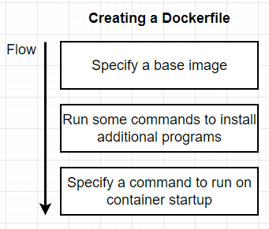

Let's create a basic **python** application which just prints something on the console.

- Create a folder on computer. It must contain the following two files:

A `main.py` file (python file that will contain the code to be executed).
A `Dockerfile` file (Docker file that will contain the necessary instructions to create the environment).

`main.py` may have the following content:

```
#!/usr/bin/env python3

print("Hello Guidemy Students!")
```

- Edit the `Dockerfile` file

Our goal here is to launch Python code.

To do this, our Docker must contain all the dependencies necessary to launch Python. A linux (Ubuntu) with Python
installed on it should be enough.

The first step to take when we create a Docker file is to access the [DockerHub website](https://hub.docker.com/).

This site contains many pre-designed images to save our time (for example, all images for linux or code languages).

In our case, we will type **"Python"** in the search bar. The first result is the official image created to execute
Python.

```
# A dockerfile must always start by importing the base image.
# We use the keyword 'FROM' to do that.
# In our example, we want import the python image.
# So we write 'python' for the image name and 'latest' for the version.
FROM python:latest

# In order to launch our python code, we must import it into our image.
# We use the keyword 'COPY' to do that.
# The first parameter 'main.py' is the name of the file on the host.
# The second parameter '/' is the path where to put the file on the image.
# Here we put the file at the image root folder.
COPY main.py /

# We need to define the command to launch when we are going to run the image.
# We use the keyword 'CMD' to do that.
# The following command will execute "python ./main.py".
CMD [ "python", "./main.py" ]
```

- Create the Docker image

Once our code is ready and the `Dockerfile` is written, all we have to do is create our docker **image** to contain our
application.

```
docker build -t python-test .
```

The `-t` option allows us to define the name of our docker image.

- Run the Docker image

```
docker run python-test
```

Our docker container should be running now and will print the message: `Hello Guidemy Students!`

---

As our next example, let's create an image that runs **redis-server**.

- Launch Ubuntu app in WSL2
- Create a new directory: `mkdir redis-image`
- Move to this directory: `cd redis-image`
- Create a new Dockerfile (using vi) with the following contents:

```
# Step 1: Use an existing docker image as a base
FROM alpine

# Step 2: Download and install dependency
RUN apk add --update redis

# Step 3: Tell the image what to do when it starts as container
CMD ["redis-server"]
```

- Build the image using Docker CLI command: `docker build .`
- Run the image using Docker CLI command: `docker run <image_id>`

The **Docker server** executes all the Docker CLI commands.

These are all the steps done for creating the redis image and running the redis server container:

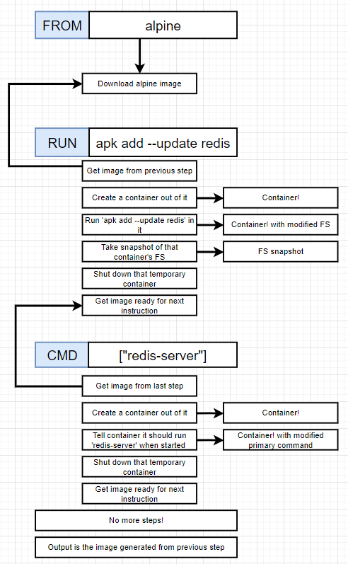

- **Tagging an image**

Instead of using `docker build .`, we can tag an image name with a version.

```
$ docker build -t <user_id>/<image_name>:<version> .

-t = instruction to tag the image with the given name
<user_id>/<image_name>:<version> = image tag
```

For example,

```
$ docker build -t risrivas/redis:latest .
```

Now, we can run redis server container by just using the tag name:

```
$ docker run risrivas/redis
```

### Build a maven-based Java project in Docker

- Launch an Ubuntu app from WSL2
- Create a new directory: `mkdir haproxy_demo`
- Move to that directory: `cd haproxy_demo`

A maven-based Java project has following directory structure along with a `pom.xml` file (better to define the class
in packages!):

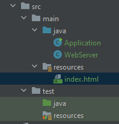

- Create a new project called **webapp** inside **haproxy_demo**

Source Java files:

`WebServer`

```java
import com.sun.net.httpserver.HttpExchange;
import com.sun.net.httpserver.HttpServer;
import org.jsoup.Jsoup;
import org.jsoup.nodes.Document;
import org.jsoup.nodes.Element;

import java.io.IOException;
import java.io.InputStream;
import java.io.OutputStream;
import java.net.InetSocketAddress;
import java.nio.charset.StandardCharsets;
import java.util.concurrent.Executors;

public class WebServer {

    private static final String STATUS_ENDPOINT = "/status";
    private static final String HOME_PAGE_ENDPOINT = "/";

    private static final String HTML_PAGE = "index.html";

    private final int port;
    private final String serverName;

    public WebServer(final int port, final String serverName) {
        this.port = port;
        this.serverName = serverName;
    }

    public void startServer() {
        final HttpServer server;
        try {
            server = HttpServer.create(new InetSocketAddress(port), 0);
        } catch (final IOException e) {
            System.err.println(e.getMessage());
            return;
        }

        server.createContext(STATUS_ENDPOINT, this::handleStatusCheckRequest);
        server.createContext(HOME_PAGE_ENDPOINT, this::handleHomePageRequest);

        server.setExecutor(Executors.newFixedThreadPool(8));
        System.out.printf("Started server %s on port %d %n", serverName, port);
        server.start();
    }

    private void handleHomePageRequest(final HttpExchange exchange) throws IOException {
        if (!exchange.getRequestMethod().equalsIgnoreCase("get")) {
            exchange.close();
            return;
        }

        System.out.printf("%s received a request%n", this.serverName);
        exchange.getResponseHeaders().add("Content-Type", "text/html");
        exchange.getResponseHeaders().add("Cache-Control", "no-cache");

        final byte[] response = loadHtml();

        sendResponse(response, exchange);
    }

    /**
     * Loads the HTML page to be fetched to the web browser
     */
    private byte[] loadHtml() throws IOException {
        final InputStream htmlInputStream = getClass().getResourceAsStream(WebServer.HTML_PAGE);
        if (htmlInputStream == null) {
            return new byte[]{};
        }

        final Document document = Jsoup.parse(htmlInputStream, StandardCharsets.UTF_8.name(), "");

        final String modifiedHtml = modifyHtmlDocument(document);
        return modifiedHtml.getBytes();
    }

    /**
     * Fills the server's name and local time in theHTML document
     *
     * @param document - original HTML document
     */
    private String modifyHtmlDocument(final Document document) {
        final Element serverNameElement = document.selectFirst("#server_name");
        serverNameElement.appendText(serverName);
        return document.toString();
    }

    private void handleStatusCheckRequest(final HttpExchange exchange) throws IOException {
        if (!exchange.getRequestMethod().equalsIgnoreCase("get")) {
            exchange.close();
            return;
        }

        System.out.println("Received a health check");
        final String responseMessage = String.format("Server is alive%n");
        sendResponse(responseMessage.getBytes(), exchange);
    }

    private void sendResponse(final byte[] responseBytes, final HttpExchange exchange) throws IOException {
        exchange.sendResponseHeaders(200, responseBytes.length);
        final OutputStream outputStream = exchange.getResponseBody();
        outputStream.write(responseBytes);
        outputStream.flush();
        outputStream.close();
    }

}

```

`Application`

```java
public class Application {

    public static void main(final String[] args) {
        if (args.length != 2) {
            System.out.println("java -jar (jar name) PORT_NUMBER SERVER_NAME");
        }
        final int currentServerPort = Integer.parseInt(args[0]);
        final String serverName = args[1];

        final WebServer webServer = new WebServer(currentServerPort, serverName);

        webServer.startServer();
    }

}

```

- `index.html` file in resources folder:

```html
<!DOCTYPE html>
<html>
<head>
    <title>Distributed Search</title>
    <meta http-equiv="cache-control" content="no-cache"/>
</head>
<body style="background: #e6f3ff;">
<h1 style="color:blue; text-align: center; font-style: bold" id="server_name_title">Welcome to </h1>
<h1 style="color:#00b4ff; text-align: center; font-style: italic" id="server_name"></h1>
</body>
</html>
```

- Create a `pom.xml` file like below:

```xml
<?xml version="1.0" encoding="UTF-8"?>

<project xmlns="http://maven.apache.org/POM/4.0.0"
         xmlns:xsi="http://www.w3.org/2001/XMLSchema-instance"
         xsi:schemaLocation="http://maven.apache.org/POM/4.0.0 http://maven.apache.org/xsd/maven-4.0.0.xsd">
    <modelVersion>4.0.0</modelVersion>

    <groupId>distributed.systems</groupId>
    <artifactId>webapp</artifactId>
    <version>1.0-SNAPSHOT</version>

    <build>
        <plugins>
            <plugin>
                <groupId>org.apache.maven.plugins</groupId>
                <artifactId>maven-compiler-plugin</artifactId>
                <version>3.8.0</version>
                <configuration>
                    <release>11</release>
                </configuration>
            </plugin>

            <plugin>
                <artifactId>maven-assembly-plugin</artifactId>
                <executions>
                    <execution>
                        <phase>package</phase>
                        <goals>
                            <goal>single</goal>
                        </goals>
                    </execution>
                </executions>
                <configuration>
                    <archive>
                        <manifest>
                            <mainClass>Application</mainClass>
                        </manifest>
                    </archive>
                    <descriptorRefs>
                        <descriptorRef>jar-with-dependencies</descriptorRef>
                    </descriptorRefs>
                </configuration>
            </plugin>

        </plugins>

    </build>

    <dependencies>

        <dependency>
            <groupId>org.jsoup</groupId>
            <artifactId>jsoup</artifactId>
            <version>1.12.1</version>
        </dependency>

    </dependencies>


</project>

```

- Build the project and package it by running command: `mvn clean package`
- Let's run this java project by running the following command from the terminal:

```
~/haproxy_demo/webapp$ sudo /usr/bin/java -jar target/webapp-1.0-SNAPSHOT-jar-with-dependencies.jar 80 Server
Started server Server on port 80
```

- Now launch a browser with the link as: `http://localhost:80/`
- It should display:


**_Migrating the project to Docker_**

- Let's create a `Dockerfile` to create an image of this project

`dockerfile`

```
# Step 1: Base image which has maven version 3.6.1 and jdk-11 already installed
FROM maven:3.6.1-jdk-11 AS MAVEN_TOOL_CHAIN_CONTAINER

# Step 2: Copy and create the same maven-based Java project into the container
RUN mkdir src
COPY src /tmp/src
COPY ./pom.xml /tmp/
WORKDIR /tmp/
RUN mvn package
RUN ls -la /tmp

FROM openjdk:11
COPY --from=MAVEN_TOOL_CHAIN_CONTAINER /tmp/target/webapp-1.0-SNAPSHOT-jar-with-dependencies.jar /tmp/
WORKDIR /tmp/

# Step 3: Run the application and provide necessary arguments to the main program
ENTRYPOINT ["java","-jar", "webapp-1.0-SNAPSHOT-jar-with-dependencies.jar"]
CMD ["80", "Server Name"]

```

Our project structure should look like this:

```
~/haproxy_demo/webapp$ ls
dockerfile  pom.xml  src  target
```

- Build the docker image

```
$ docker build -f dockerfile -t risrivas/webapp:latest .
```

- Run the docker container

```
~/haproxy_demo/webapp$ docker run risrivas/webapp
Started server Server Name on port 80
```

- However, when we launch a browser with the link as: `http://localhost:80/`, we cannot see anything loaded

The reason is that server "Server Name" is running on port `80` inside the docker container which is a sandbox or
isolated environment.

We can do port mapping using `-p` option while we run our docker container.

```
~/haproxy_demo/webapp$ docker run -p 80:80 risrivas/webapp
Started server Server Name on port 80
```

- Now relaunch a browser with the link as: `http://localhost:80/`
- It should display:


### Docker RUN vs CMD vs ENTRYPOINT

- **RUN** executes command(s) in a new layer and creates a new image; for example, it is often used for installing
  software packages
- **CMD** sets default command and/or parameters, which can be overwritten from the command line when docker container
  runs
- **ENTRYPOINT** configures a container that will run as an executable

When Docker runs a container, it runs an image inside it.

This image is usually built by executing Docker instructions, which add layers on top of existing image or OS
distribution.

OS distribution is the initial image, and every added layer creates a new image.

The final Docker image reminds an _onion_ with OS distribution inside and a number of layers on top of it.

For example, our image can be built by installing a number of deb packages and our application on top of Ubuntu 14.04
distribution.

All three instructions (**RUN**, **CMD** and **ENTRYPOINT**) can be specified in `shell` form or `exec` form.

**_Shell form_**

```
<instruction> <command>
```

For example,

```
RUN apt-get install python3
CMD echo "Hello world"
ENTRYPOINT echo "Hello world"
```

When instruction is executed in `shell` form it calls `/bin/sh -c <command>` under the hood and normal shell processing
happens.

For example, the following snippet in Dockerfile:

```
ENV name Caspar Cheung
ENTRYPOINT echo "Hello, $name"
```

When container runs as `docker run -it <image>` will produce output: `Hello, Caspar Cheung`.

Note that variable `name` is replaced with its value.

**_Exec form_**

```
<instruction> ["executable", "param1", "param2", ...]
```

For example,

```
RUN ["apt-get", "install", "python3"]
CMD ["/bin/echo", "Hello world"]
ENTRYPOINT ["/bin/echo", "Hello world"]
```

When instruction is executed in `exec form`, it calls executable directly, and shell processing does **NOT** happen.

For example, the following snippet in Dockerfile:

```
ENV name Caspar Cheung
ENTRYPOINT ["/bin/echo", "Hello, $name"]
```

When container runs as `docker run -it <image>` will produce output: `Hello, $name`

Note that variable `name` is **NOT** substituted.

However, this is the preferred form for **CMD** and **ENTRYPOINT** instructions.

If we need to run `bash` (or any other interpreter but `sh`), use `exec form` with `/bin/bash` as executable.

In this case, normal shell processing will take place.

For example, the following snippet in Dockerfile:

```
ENV name Caspar Cheung
ENTRYPOINT ["/bin/bash", "-c", "echo Hello, $name"]
```

When container runs as `docker run -it <image>` will produce output: `Hello, Caspar Cheung`.

**_RUN_**

RUN instruction allows us to install our application and packages required for it.

It executes any commands on top of the current image and creates a new layer by committing the results.

Often we will find **multiple** RUN instructions in a Dockerfile.

RUN has two forms:

- RUN `<command> (shell form)`
- RUN `["executable", "param1", "param2"] (exec form)`

A good illustration of RUN instruction would be to install multiple version control systems packages:

```
RUN apt-get update && apt-get install -y \
  bzr \
  cvs \
  git \
  mercurial \
  subversion
```

Note that `apt-get update` and `apt-get install` are executed in a single RUN instruction.

This is done to make sure that the **latest** packages will be installed.

If `apt-get install` were in a separate RUN instruction, then it would reuse a layer added by `apt-get update`, which
could had been created a long time ago.

**_CMD_**

CMD instruction allows us to set a **default command**, which will be executed only when we run container without
specifying a command.

If a Docker container runs with a command, the default command will be ignored.

If Dockerfile has more than one CMD instruction, all but **last** CMD instructions are ignored.

CMD has three forms:

- CMD `["executable","param1","param2"]` (exec form, preferred)
- CMD `["param1","param2"]` (sets additional default parameters for ENTRYPOINT in exec form)
- CMD `command param1 param2` (shell form)

The second one is used together with ENTRYPOINT instruction in exec form.

It sets default parameters that will be added after ENTRYPOINT parameters if a container runs without command line
arguments.

For example, the following snippet in Dockerfile:

```
CMD echo "Hello world" 
```

When container runs as `docker run -it <image>` will produce output: `Hello world`.

But when container runs with a command, e.g., `docker run -it <image> /bin/bash`, CMD is **ignored** and bash
interpreter runs instead:

```
root@7de4bed89922:/#
```

**_ENTRYPOINT_**

ENTRYPOINT instruction allows us to configure a container that will run as an executable.

It looks similar to CMD, because it also allows us to specify a command with parameters.

The difference is ENTRYPOINT command and parameters are **not ignored** when Docker container runs with command line
parameters. (There is a way to ignore ENTTRYPOINT, but it is unlikely that we will do it.)

ENTRYPOINT has two forms:

- ENTRYPOINT `["executable", "param1", "param2"]` (exec form, preferred)
- ENTRYPOINT `command param1 param2` (shell form)

We need to be cautious when choosing ENTRYPOINT form, because forms behavior differs significantly.

**Exec form**

Exec form of ENTRYPOINT allows us to set commands and parameters and then use either form of CMD to set additional
parameters that are more likely to be changed.

ENTRYPOINT arguments are always used, while CMD ones can be overwritten by command line arguments provided when Docker
container runs.

For example, the following snippet in Dockerfile:

```
ENTRYPOINT ["/bin/echo", "Hello"]
CMD ["world"]
```

When container runs as `docker run -it <image>` will produce output: `Hello world`.

But when container runs as `docker run -it <image> Caspar` will result in: `Hello Caspar`.

**Shell form**

Shell form of ENTRYPOINT **ignores** any CMD or docker run command line arguments.

**To summarize,**

- Use **RUN** instructions to build our image by adding layers on top of the initial image
- Prefer ENTRYPOINT to CMD when building executable Docker image, and we need a command **always** to be executed.
  Additionally, use CMD if we need to provide extra default arguments that could be overwritten from command line when
  docker container runs.
- Choose CMD if we need to provide a default command and/or arguments that can be overwritten from the command line when
  docker container runs.

---

## Chapter 04. Docker Compose

